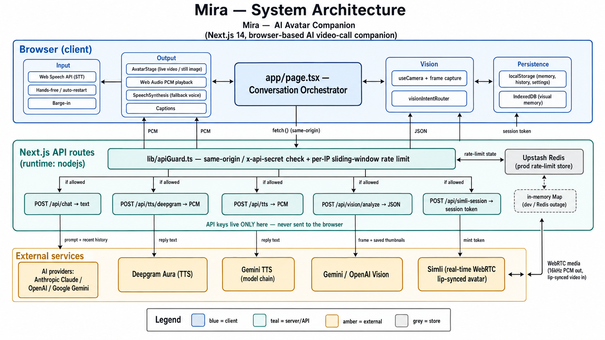

# AI Avatar Companion

A browser-based AI video-call companion. Open the app, see a warm human-like
avatar on screen, talk to her with your microphone, and she replies with a
natural voice — like a one-to-one video call with an assistant.

When a live-avatar provider is configured, she becomes a **real-time,
lip-synced video** that moves and speaks as she talks. Without one, she
gracefully falls back to a still image with the browser's built-in voice, so
the app always works.

Prefer to type? There's also a **WhatsApp-style text chat** over the same
conversation. And it's an **installable PWA** — add it to your home screen and
it opens full-screen, works offline, and is tuned to feel native on phones
(notch / home-indicator safe areas, keyboard-aware chat).

It runs in any modern browser — desktop or mobile — and is structured so a
Raspberry Pi / ESP32 client could drive it over HTTP later without
re-architecting the core.

Built by **Vaibhav Rajput**.

---

## Quick start

```bash
# 1. Install
npm install

# 2. Configure (optional — works in demo mode without keys)
cp .env.example .env.local
# Then edit .env.local and paste an API key (see "Configuration" below)

# 3. Run
npm run dev
```

Open <http://localhost:3000> in Chrome or Edge. Click the mic button, grant
microphone permission, and speak.

> **Browser support:** speech recognition uses the Web Speech API, which works
> in Chrome, Edge, and Safari. Firefox doesn't support it — use the text chat
> or the text input fallback there.

> **Testing the PWA:** the service worker (offline + install) only runs in a
> production build, not `npm run dev`. Use `npm run build && npm start` to try
> installing and offline behavior.

---

## Features

| Area | Feature | Status |
| --- | --- | --- |
| Conversation | Three AI providers — Anthropic Claude, OpenAI, Google Gemini | ✅ |
| Conversation | Secure server-side proxy (`/api/chat`) — keys never reach the browser | ✅ |
| Conversation | Per-session history + `localStorage` memory (name, preferences, notes) | ✅ |
| Conversation | Bounded context window (recent turns only) — caps cost & latency | ✅ |
| Security | Rate limiting + same-origin guard on every API route | ✅ |
| Input | Push-to-talk + click-to-toggle mic (Web Speech STT) | ✅ |
| Input | **Hands-free mode** — keeps listening across pauses, re-opens mic after replies | ✅ |
| Input | Text input fallback when mic is denied or unsupported | ✅ |
| Avatar | **Live, lip-synced video avatar** via Simli (real-time WebRTC) | ✅ |
| Avatar | Gemini text-to-speech drives the avatar's lips | ✅ |
| Avatar | Graceful fallback to still image + browser `SpeechSynthesis` | ✅ |
| Avatar | Toggle live video ↔ still image in Settings | ✅ |
| Avatar | State-driven aura (idle / listening / thinking / speaking / error) | ✅ |
| Avatar | Watchdog recovery — never gets stuck on "Thinking" if the stream stalls | ✅ |
| Voice | **Sentence-chunked TTS** — starts speaking after the first part of long replies | ✅ |
| UX | Barge-in: start talking and she stops mid-sentence | ✅ |
| UX | **Captions** — show her spoken reply as on-screen text (accessibility) | ✅ |
| UX | Offline banner + one-tap **Retry** on a failed turn | ✅ |
| UX | Settings panel, collapsible transcript, error handling | ✅ |
| Chat | WhatsApp-style text chat (bubbles, timestamps, typing indicator) | ✅ |
| Chat | Shares the same history as the call; text-only (no voice) | ✅ |
| PWA | Installable, standalone, offline app-shell caching, app icons | ✅ |
| Mobile | Responsive with safe-area insets, `dvh` sizing, keyboard-aware chat | ✅ |
| Vision | **Mira Vision** — camera sight, describe scenes, teach/recognize objects | ✅ |
| Vision | Opt-in known-person enrollment (consent-gated); strangers never identified | ✅ |
| Vision | Local visual memory (IndexedDB), managed in Settings | ✅ |
| Vision | **Live Vision Conversation** — voice-first; auto-captures only when asked | ✅ |
| Vision | Image-to-image recognition — saved thumbnails are compared directly | ✅ |

---

## Architecture & flow

Everything is a **thin Next.js app**: a rich client (the orchestrator in
`app/page.tsx`) talks only to **same-origin API routes**, which proxy the
external providers. API keys live exclusively on the server; the browser never
sees `SIMLI_API_KEY` or any AI key — only a short-lived Simli session token and
synthesized audio.



> 📊 **More diagrams** — the conversation flow and the voice / vision sequence
> diagrams (plus editable Mermaid sources) live in
> **[docs/ARCHITECTURE.md](docs/ARCHITECTURE.md)**.

Every route first passes through **`guard()`** ([lib/apiGuard.ts](lib/apiGuard.ts)):
a same-origin / shared-secret check, then a per-IP sliding-window rate limit
(distributed via Upstash in prod, in-memory in dev). See
[Abuse & cost protection](#abuse--cost-protection).

### A voice-call turn (step by step)

```
You speak ─▶ Web Speech STT ─▶ [Live Vision? classify intent] ─▶ POST /api/chat
                                                                       │ reply text
                                                                       ▼
                                      split into sentence chunks (lib/textChunks)
                                                                       │
                         ┌─────────────────────────────────────────────┘
                         ▼  per chunk, prefetch next while current plays
              TTS chain:  Deepgram ─▶ Gemini TTS ─▶ browser SpeechSynthesis
                         │ PCM                         │ (last-resort voice)
              ┌──────────┴───────────┐
              ▼ live mode            ▼ still mode
   resample 16kHz → Simli      Web Audio plays PCM
   (lip-synced video)          (over still image)
```

1. **You speak** → transcribed locally by the Web Speech API. Mid-sentence
   pauses don't cut you off (silence-finalize); on mobile the mic auto-restarts
   if the engine self-stops, and **hands-free mode** re-opens it after each reply.
2. If the camera is open in **Live Vision**, the turn is first classified by
   `visionIntentRouter`; a vision intent captures a frame and may answer directly
   or attach "what the camera sees" context to the chat call.
3. The transcript (recent-turn window + memory + system prompt) goes to
   **`/api/chat`**, which calls the configured provider and returns the reply.
4. The reply is split into **sentence chunks**; each chunk's audio is fetched
   through the TTS chain (**Deepgram → Gemini → browser**) while the previous
   chunk plays, so she starts talking after the first sentence.
5. **Live mode:** PCM is resampled to 16 kHz and streamed to **Simli**, which
   lip-syncs a photoreal face. **Still mode:** the PCM is played via Web Audio
   over the still image. A **watchdog** recovers to the browser voice if the live
   stream accepts audio but never starts speaking.
6. **Barge-in:** start talking (or tap the mic) and any in-progress speech stops
   immediately.

### A Mira Vision turn

```
Camera open ─▶ you talk ─▶ visionIntentRouter (regex classify)
                              │
         ┌────────────────────┼──────────────────────────┐
         ▼ describe/recognize ▼ remember (object/person)  ▼ normal_chat
   capture frame +        capture + (consent gate for     fall through to
   saved thumbnails ─▶    people) ─▶ save to IndexedDB    /api/chat
   POST /api/vision/analyze
         │ structured JSON (description, matchedLabel, …)
         ▼
   spoken reply via the same voice pipeline
```

Recognition sends your saved **thumbnails alongside the live frame**, so the
model compares **image-to-image** and returns the matching label directly. No
video is ever stored — only thumbnails you capture, in your browser's IndexedDB.

### Graceful degradation (nothing hard-fails)

| If this is missing / fails… | …the app does this instead |
| --- | --- |
| Chosen AI provider key | Falls back to any other configured provider, then demo mode |
| Deepgram TTS | Falls back to Gemini TTS, then the browser voice |
| Simli (live avatar) | Falls back to still image + browser/Web-Audio voice |
| Live stream stalls | Watchdog recovers to the browser voice |
| Camera / mic denied | Voice/vision disabled gracefully; text chat still works |
| Network offline | Offline banner + one-tap Retry on the failed turn |
| Upstash Redis | Falls back to the in-memory rate limiter |
| Web Speech API (e.g. Firefox) | Use the text chat / text input |

---

## Configuration

Copy `.env.example` to `.env.local` and fill in what you need. Everything is
optional — with no keys at all, the app runs in **demo mode** with friendly mock
replies so you can review the UI before signing up for anything.

### 1. AI provider (pick one)

Set `AI_PROVIDER` to `anthropic`, `openai`, or `google`, then provide the
matching key:

| Provider | Key | Model var (default) | Get a key |
| --- | --- | --- | --- |
| Anthropic Claude | `ANTHROPIC_API_KEY` | `ANTHROPIC_MODEL` (`claude-sonnet-4-6`) | <https://console.anthropic.com/> |
| OpenAI | `OPENAI_API_KEY` | `OPENAI_MODEL` (`gpt-4o-mini`) | <https://platform.openai.com/> |
| Google AI Studio | `GOOGLE_API_KEY` | `GOOGLE_MODEL` (`gemini-2.0-flash`) | <https://aistudio.google.com/app/apikey> |

If the chosen provider's key is missing, the app falls back to any other
configured provider, and finally to demo mode.

### 2. Live video avatar (optional)

To turn the avatar into a real-time lip-synced video, add a
[Simli](https://app.simli.com/) account's credentials:

| Var | Purpose |
| --- | --- |
| `SIMLI_API_KEY` | Your Simli API key (server-side only) |
| `SIMLI_FACE_ID` | The face to render (from the Simli dashboard) |
| `GEMINI_TTS_MODEL` | TTS model that voices the avatar (default `gemini-2.5-flash-preview-tts`) |
| `GEMINI_TTS_VOICE` | Voice name — e.g. `Kore`, `Aoede`, `Puck`, `Charon`, `Leda`, `Zephyr` |

The avatar's voice reuses your **`GOOGLE_API_KEY`** for TTS, so no extra key is
needed beyond Simli. When `SIMLI_API_KEY` / `SIMLI_FACE_ID` are absent, the live
avatar is silently disabled and the still-image experience is used instead.

### Voice in both modes

Both **Live** and **Still image** modes speak through the same 3-tier fallback
chain (live mode lip-syncs the audio on Simli; still mode plays it via Web
Audio):

1. **Deepgram Aura** (`/api/tts/deepgram`) — primary, when `DEEPGRAM_API_KEY` is
   set. Returns raw PCM.
2. **Gemini TTS** (`/api/tts`) — the Gemini model chain, if Deepgram fails / has
   no key. Also raw PCM.
3. **Browser Web Speech** (`speakWithBrowser`) — if both server tiers fail.

Deepgram's voice is set with `DEEPGRAM_TTS_MODEL` (default `aura-2-luna-en`);
the "Avatar voice model" / "Avatar voice" pickers in Settings apply to the
Gemini tier.

**Sentence-chunked playback:** long replies are split into sentence chunks and
the next chunk's audio is prefetched while the current one plays, so she starts
talking after the first part instead of waiting for the whole reply to
synthesize. Short/medium replies stay a single request (no added overhead).

> **Cost note:** Gemini TTS bills per character and Simli bills per minute of
> streaming, so each spoken reply costs a little in **both** modes now. If you
> prefer the free browser voice, leave `GOOGLE_API_KEY` unset (or it'll be used
> for TTS). Text **chat** mode stays silent and free.

### Abuse & cost protection

Every API route is guarded so a public deployment can't be trivially used to
burn your paid quota ([lib/apiGuard.ts](lib/apiGuard.ts)):

- **Same-origin check** — requests from other origins are rejected (`403`). Set
  `API_SHARED_SECRET` and send it as an `x-api-secret` header to allow a trusted
  programmatic caller through.
- **Per-IP sliding-window rate limit** — per route (`429` with `Retry-After`
  when exceeded). Limits are tuned per route (chat/vision lower, TTS higher
  since chunked replies make several calls).
- **Payload caps** — `/api/chat` bounds message count/size and only the recent
  window of turns is sent to the model.

### Distributed rate limiting (Upstash Redis)

The limiter is **serverless-friendly**: in-memory `Map`s reset every time a
Vercel function cold-starts, so they're ineffective across instances. When you
set both env vars, the guard uses a **distributed** limiter
([@upstash/ratelimit](https://github.com/upstash/ratelimit-js) + Redis) shared
by all instances:

| Var | Purpose |
| --- | --- |
| `UPSTASH_REDIS_REST_URL` | Upstash Redis REST URL |
| `UPSTASH_REDIS_REST_TOKEN` | Upstash Redis REST token |

```bash
npm install @upstash/ratelimit @upstash/redis
```

Create a free database at <https://console.upstash.com/>, copy its REST URL +
token into `.env.local`, and it activates automatically. Performance details:

- A shared in-instance **`ephemeralCache`** short-circuits repeat hits, so a
  blocked IP doesn't trigger a Redis round-trip on every request — lower latency
  and fewer Redis calls.
- Redis client + `Ratelimit` instances are **singletons** reused across warm
  invocations; analytics writes are disabled to keep each check cheap.
- If the env vars are **absent** (local dev) the guard transparently falls back
  to the in-memory limiter — no Redis setup required. The same fallback also
  catches a Redis outage, so a transient failure can't take the app down.

> `guard()` is async (the distributed check is a network call); routes simply
> `await guard(...)`. Its signature is otherwise unchanged.
>
> **Rotate any keys** that have been shared in plaintext — they're treated as
> compromised.

---

## Project structure

```
ai-avatar-companion/
├── app/
│   ├── api/
│   │   ├── chat/route.ts          # AI proxy: Anthropic / OpenAI / Google (server only)
│   │   ├── tts/route.ts           # Gemini text-to-speech → base64 PCM (server only)
│   │   ├── tts/deepgram/route.ts  # Deepgram Aura TTS → base64 PCM (primary, server only)
│   │   ├── simli-session/route.ts # Mints a Simli session token (server only)
│   │   └── vision/analyze/route.ts # Mira Vision: image → structured analysis (server only)
│   ├── globals.css                # Tailwind + design tokens
│   ├── layout.tsx
│   └── page.tsx                   # Main UI & conversation orchestrator
├── components/
│   ├── AvatarStage.tsx            # Live video / still image + state-driven aura
│   ├── ChatView.tsx               # WhatsApp-style full-screen text chat
│   ├── StatusIndicator.tsx        # Status pill: Ready / Listening / Speaking…
│   ├── MicButton.tsx              # Mic UI (push-to-talk or click-to-talk)
│   ├── ChatTranscript.tsx         # Collapsible right-side transcript
│   ├── SettingsPanel.tsx          # Name, volume, voice, avatar/mic mode, hands-free, captions, vision, reset
│   ├── CameraPanel.tsx            # Mira Vision camera UI (Look / Teach / Close)
│   ├── VisionMemoryPanel.tsx      # Manage learned objects/people (Settings)
│   ├── PermissionSetup.tsx        # First-run camera+mic permission onboarding
│   ├── ServiceWorkerRegistrar.tsx # Registers the PWA service worker (prod only)
│   └── ErrorBoundary.tsx
├── lib/
│   ├── apiClient.ts               # Frontend → /api/chat
│   ├── apiGuard.ts                # Same-origin guard + rate limit (Upstash Redis, in-memory fallback)
│   ├── speechRecognition.ts       # Web Speech API wrapper (STT, silence finalize)
│   ├── speechSynthesis.ts         # SpeechSynthesis wrapper + voice picker (fallback TTS)
│   ├── ttsAudio.ts                # TTS fetch chain + chunked PCM playback (still mode)
│   ├── textChunks.ts              # Splits a reply into prefetchable sentence chunks
│   ├── audio.ts                   # Base64 PCM decode + resample to 16kHz for Simli
│   ├── useSimliAvatar.ts          # Live avatar lifecycle hook (connect/speakChunks/clear/stop)
│   ├── useCamera.ts               # getUserMedia camera hook + frame capture
│   ├── visionClient.ts            # Vision analyze fetch + thumbnail candidates + matching
│   ├── visionIntentRouter.ts      # Classifies a turn into a vision intent
│   ├── permissionManager.ts       # Centralized camera+mic permission flow
│   ├── visualMemory.ts            # IndexedDB visual-memory store (CRUD + export/import)
│   └── memoryManager.ts           # localStorage persistence
├── scripts/
│   └── generate-icons.mjs         # Zero-dependency PWA icon generator
├── types/index.ts                 # Shared TypeScript types
├── public/
│   ├── avatar.png                 # Fallback still image
│   ├── manifest.webmanifest       # PWA manifest
│   ├── service-worker.js          # Offline app-shell caching
│   └── icon-*.png                 # App icons (generated by the script above)
└── .env.example                   # Copy to .env.local and fill in keys
```

---

## Controls

| Action | How |
| --- | --- |
| Start / stop listening | Click the mic button (or hold it in push-to-talk mode) |
| Stop her mid-sentence | "Stop" button next to the mic while she's speaking (or just start talking — barge-in) |
| Open the text chat | Chat icon (top right) — back arrow returns to the call |
| Type instead of speaking | Text chat, or the quick text input below the mic |
| Show transcript | "Show" button next to the mic, or expand from the right edge |
| Switch live video ↔ still image | Gear icon → **Avatar** (only shown when Simli is configured) |
| Hands-free conversation | Settings → **Hands-free** — mic stays open across pauses and re-opens after each reply |
| Show captions | Settings → **Captions** — her spoken reply appears on screen |
| Retry a failed turn | "Retry" button under the avatar after a connection error |
| Change name / voice / volume / mic mode | Gear icon top right |
| Reset everything | Settings → "Reset conversation & memory" |

### Two ways to talk

- **Call mode** (default) — voice-first: speak and hear her reply, with the live
  (or fallback) avatar reacting on screen.
- **Chat mode** — a quiet, WhatsApp-style text conversation over the *same*
  history. Text-only, so no audio plays. Opening chat also drops the live
  avatar stream so it isn't billing in the background.

---

## Tech stack

- **Next.js 14** (App Router) + **React 18** + **TypeScript**
- **Tailwind CSS** for styling
- **simli-client** for the real-time WebRTC avatar
- Browser **Web Speech API** for speech-to-text and fallback text-to-speech
- AI providers via plain `fetch` (Anthropic Messages, OpenAI Chat Completions,
  Gemini `generateContent`) — no heavy SDKs in the request path

---

## Mira Vision

Mira can see through your camera, describe what she sees, learn objects, and
recognize them later. It's fully modular and opt-in — the camera never starts on
its own.

### Setup

No extra keys: vision reuses your existing **`GOOGLE_API_KEY`** (Gemini vision)
or **`OPENAI_API_KEY`** (OpenAI vision), chosen the same way as `AI_PROVIDER`.
Optionally override the model with `GEMINI_VISION_MODEL` / `OPENAI_VISION_MODEL`.
If no vision provider is configured, the analyze route returns a clear error.

### Using it

Tap the **camera icon** (top right) to open Mira Vision. On phones it opens the
**back camera by default** (you mostly point it at objects, desks, parcels,
rooms) and you can **switch between front and back** with the toggle on the
preview — front is handy for face/person chat. Your choice is remembered for
next time. The manual buttons are still there as a fallback:

- **Look** — capture a frame; Mira describes the scene and names any learned
  object she recognizes ("That looks like your guitar.").
- **Teach object** — capture → label + notes → saved to local visual memory.
- **Teach person** — *opt-in, consent-gated.* Confirm permission, capture 3
  angles, add a name/context.
- **Close camera** — stops the stream immediately.

### Live Vision Conversation Mode (voice-first)

Once the camera is on, you don't need the buttons — **just talk** and Mira
captures a frame automatically when your words call for it. Every reply comes
back through the normal voice/avatar pipeline (Simli or browser TTS), not just
the screen. The header shows a **Live Vision** badge and a status line
("Looking now", "Recognizing", "I need a label"…).

Each turn is classified ([lib/visionIntentRouter.ts](lib/visionIntentRouter.ts))
into one of: `normal_chat`, `describe_current_view`, `remember_current_object`,
`recognize_current_view`, `remember_current_person`, `recognize_known_person`,
`forget_visual_memory`. Only vision intents touch the camera; normal chat never
does.

Examples:

- "What do you see?" / "What's on my desk?" → captures + describes the scene.
- "Remember this as my black keyboard." → captures, saves the object, confirms
  by voice. (No label? She asks "What should I remember this as?")
- "Do you remember this?" → captures and compares to your saved objects.
- "Who is this?" → only recognizes enrolled people; otherwise "I see a person,
  but I don't recognize them."
- "This is my friend Amit, remember him." → asks for consent first, then saves
  on your confirmation.
- "Forget my keyboard." → deletes that memory.

Toggles in **Settings → Mira Vision**: *Live Vision conversation*,
*Auto-capture for vision questions*, *Known-person recognition* (off by
default), and *Ask before saving a person* (always on).

### How matching works

When you ask Mira to recognize something, the saved **thumbnails** of your
candidate memories are sent alongside the live frame, so the vision model
compares **image to image** and returns the matching label directly — far more
reliable than text-only matching. Mira prefers that signal and falls back to a
label/keyword heuristic (weighted by the model's confidence) if no direct match
is reported. If unsure, she says so rather than guessing. A future improvement is
multimodal embeddings for even more robust matching.

### Privacy & safety

- The camera **never starts automatically** — only after you tap to open it, and
  a red "Camera on" indicator is shown while it's live.
- **No video is persisted.** Only still thumbnails *you* capture are saved, in
  your browser's IndexedDB (managed in **Settings → Mira Vision → Manage visual
  memories**: view, rename, delete, export/import JSON).
- **Strangers are never identified.** Person recognition is **off by default**
  and only matches people you explicitly enrolled with consent. If unsure, Mira
  says "I see a person" rather than guessing an identity.
- Frames are sent to your configured vision provider (Google/OpenAI) only when
  you capture; API keys stay server-side and raw provider errors are never
  exposed to the browser.

---

## Permissions on mobile / PWA

Mira uses one **centralized permission setup**: on first run a card asks to
enable camera + microphone *together* (one `getUserMedia({ audio, video })`),
then immediately stops the tracks so nothing stays active. The grant is shared
by every feature (voice + Mira Vision), so you're asked once rather than per
module. The app remembers it was initialized (localStorage) and won't show the
card again once granted.

> Mira **cannot** bypass the browser/OS prompt — final control always stays with
> your browser. The manager only unifies *when* you're asked.

If the browser keeps re-prompting on mobile:

- Use the **same URL/domain** each time, or install the **PWA** (same HTTPS
  origin) — different origins have separate permissions.
- **Avoid private/incognito** mode; it forgets permissions on close.
- **iPhone Safari:** Settings → (this website) → Camera & Microphone → **Allow**.
- **Android Chrome:** Site settings → Camera/Microphone → **Allow**.

You can re-run the setup anytime via **Settings → Mira Vision → Re-run
permission setup**. Camera and mic are never auto-started, and a visible
indicator shows whenever they're actually active.

---

## Installing as an app (PWA)

The app ships a web manifest, generated icons, and a service worker, so it can
be installed to a phone home screen or desktop and launched standalone.

- **Install:** open the production build in Chrome/Edge (desktop: install icon
  in the address bar; mobile: "Add to Home Screen") or Safari on iOS
  ("Share → Add to Home Screen").
- **Offline:** the service worker precaches the app shell and uses
  network-first for navigations / stale-while-revalidate for assets, so the UI
  still opens without a connection. API calls (chat, TTS, Simli) naturally
  require the network.
- **Icons:** square brand icons are generated procedurally (no design tools or
  image libraries needed) — regenerate them anytime with:

  ```bash
  node scripts/generate-icons.mjs
  ```

> The service worker is registered **only in production builds** to avoid
> fighting Next.js hot-reload in development.

---

## Mobile / responsive

Tuned to feel native on phones (verified against iPhone SE and iPhone 13 sizes):

- `dvh` units instead of `100vh`, so the layout isn't cut off by the iOS
  Safari toolbar.
- `env(safe-area-inset-*)` padding so content clears the notch and home
  indicator (`viewport-fit=cover`).
- The text chat sizes to the **visual viewport**, keeping the composer above
  the on-screen keyboard.
- Controls live in normal flow (no fixed-footer overlap on short screens).

---

## What could be improved next

In rough order of impact:

1. **Streaming chat responses.** TTS already starts on the first sentence of a
   long reply (sentence-chunked playback); the remaining win is streaming
   `/api/chat` itself so chunking can begin before the full reply is generated.
2. **Premium / configurable TTS.** ElevenLabs or Cartesia return native
   `pcm_16000` (no resampling, lower latency) and more lifelike prosody. The
   `.env` already has ElevenLabs placeholders; `/api/tts` is the only route that
   would change.
3. **Server-side STT** for accuracy and Firefox support — Deepgram or
   AssemblyAI streaming, replacing the Web Speech API. (Hands-free mode already
   keeps the mic alive across pauses; server STT would make it fully reliable on
   mobile.)
4. **Persisted preferences.** Captions and hands-free are now persisted; volume,
   voice, mic mode, and avatar mode are still per-session — persist them too.
5. **Wake word** so the user doesn't have to click the mic (e.g. Picovoice
   Porcupine in the browser).
6. **Headless mode for ESP32 / Pi clients** — the backend routes are stateless
   and ready for embedded clients that handle their own audio I/O.

---

## Privacy & safety

- The microphone is only active during a recognition session; its state is
  always visible via the aura and the status indicator.
- Speech-to-text runs **locally in the browser** via the Web Speech API — raw
  audio is not recorded or persisted, and only the transcribed text reaches the
  server.
- In live-avatar mode, the assistant's reply text is sent to the TTS and Simli
  services to generate her voice and video.
- Conversations and memory are stored only in the browser's `localStorage`.
  There is no backend database.
- The assistant identifies as a virtual AI if asked directly, per the system
  prompt in `app/api/chat/route.ts`.
- API keys live only in `.env.local` (server-side env vars) and are never
  shipped to the browser; the client receives only a short-lived Simli session
  token.

---

## Author

Designed and built by **Vaibhav Rajput**.

---

## License & avatar credit

Replace `public/avatar.png` with any avatar image you have rights to use, and
configure a Simli face you're licensed to use. The included image is a
placeholder for development.
