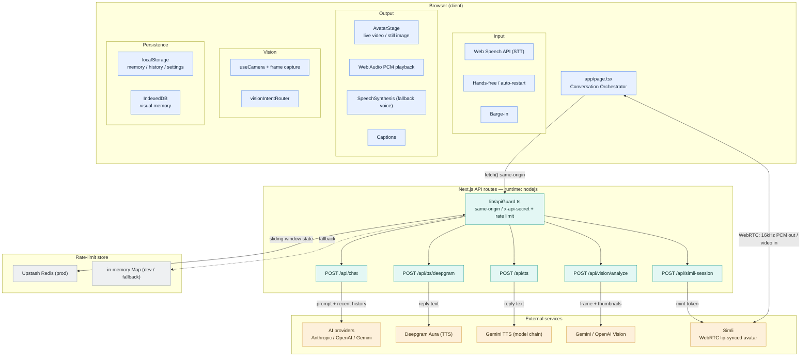
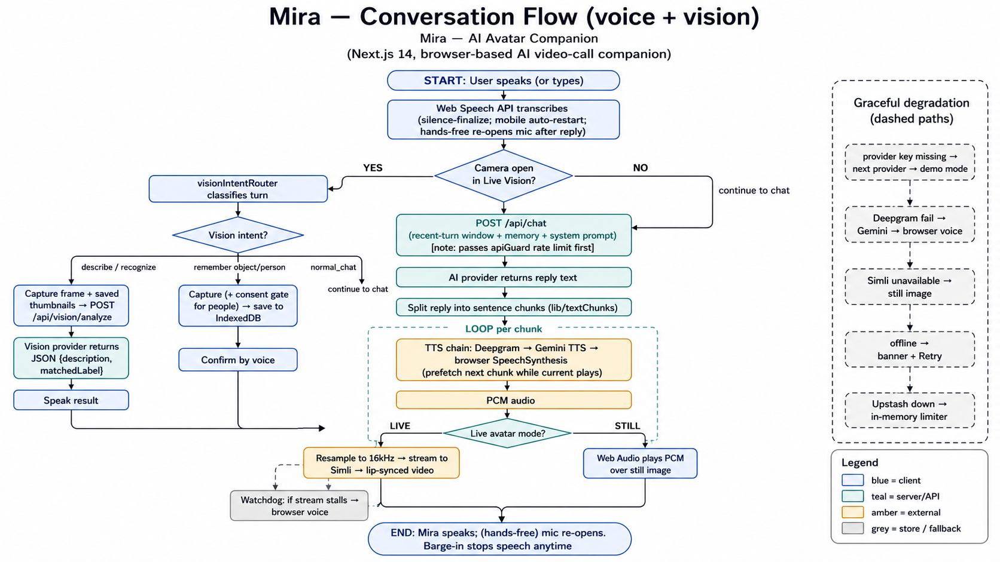
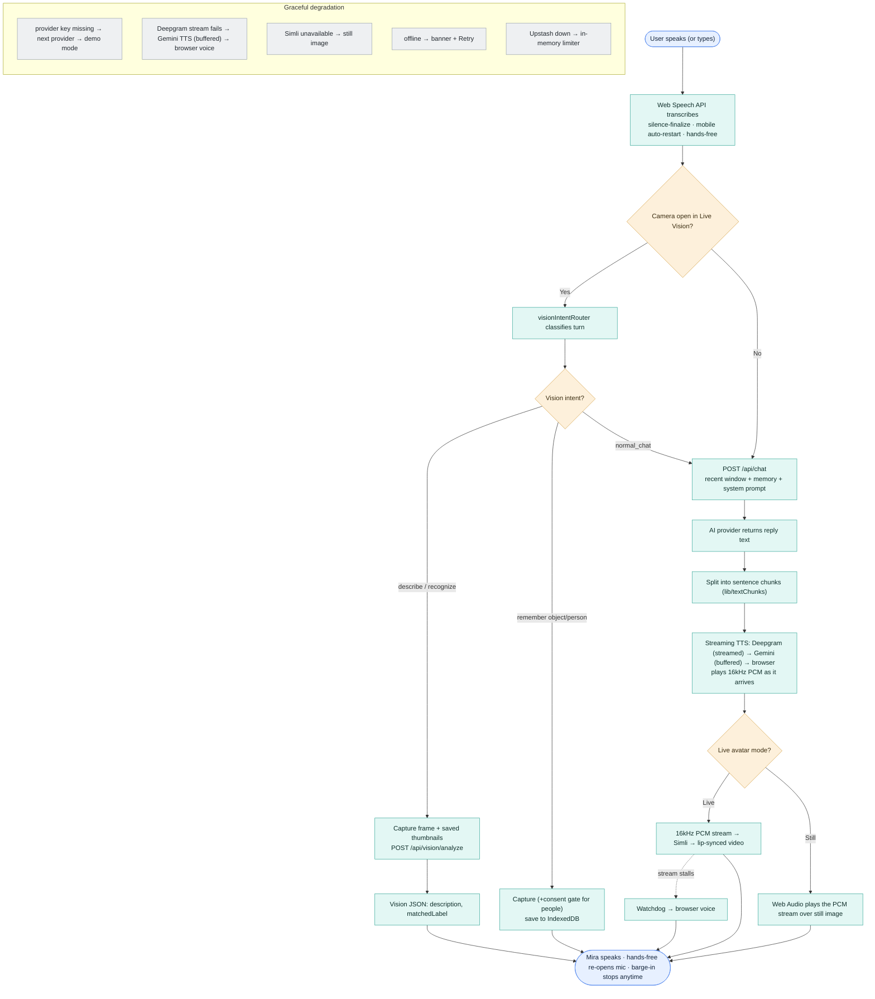
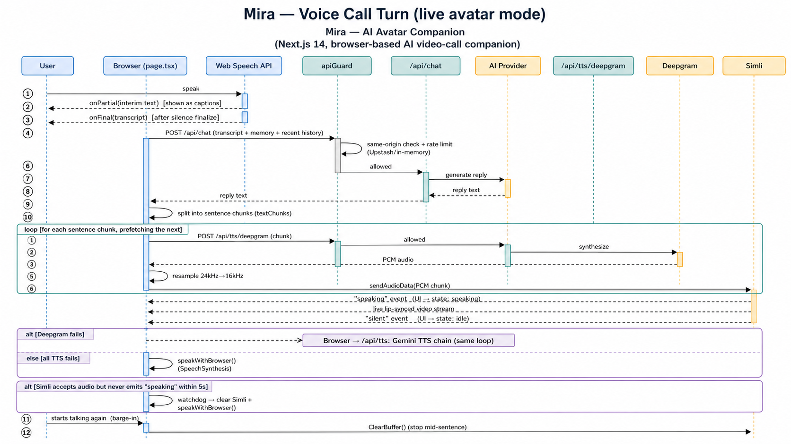
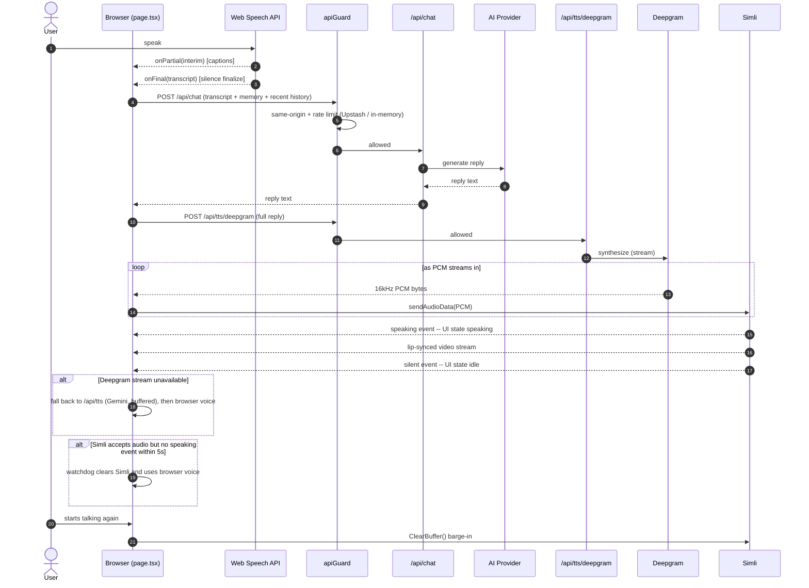
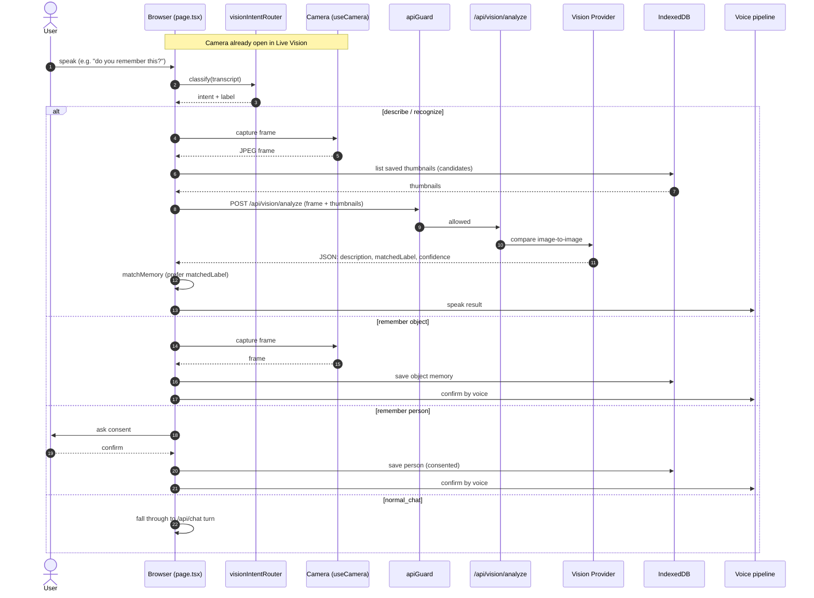

# Mira — Architecture & Diagrams

Visual reference for the **AI Avatar Companion**. Each section shows a rendered
image with the editable [Mermaid](https://mermaid.js.org/) source in a
collapsible block. The `.mmd` sources also live standalone in
[`docs/diagrams/`](diagrams/) — export them to SVG/PNG with the
[Mermaid CLI](https://github.com/mermaid-js/mermaid-cli):

```bash
npx -p @mermaid-js/mermaid-cli mmdc -i docs/diagrams/architecture.mmd -o docs/diagrams/architecture.png
```

> When the system changes, update the `.mmd` source, re-export the PNG, and keep
> the Mermaid block below in sync.

---

## 1. System architecture

A thin Next.js app: a rich browser client talks only to same-origin API routes,
which proxy the external providers. **API keys live only on the server.**


<details>
<summary>Mermaid source</summary>



</details>

---

## 2. Conversation flow (voice + vision)



> _Note: this PNG predates the streaming-TTS update — the Mermaid source below is current. Re-export to refresh._

<details>
<summary>Mermaid source</summary>



</details>

---

## 3. Sequence — voice call turn (live avatar mode)



> _Note: this PNG predates the streaming-TTS update — the Mermaid source below is current. Re-export to refresh._

<details>
<summary>Mermaid source</summary>



</details>

---

## 4. Sequence — Mira Vision turn (remember / recognize)

> No exported image yet — render
> [`diagrams/sequence-vision-turn.mmd`](diagrams/sequence-vision-turn.mmd) with the
> Mermaid CLI to add one. The diagram renders inline below on GitHub.


