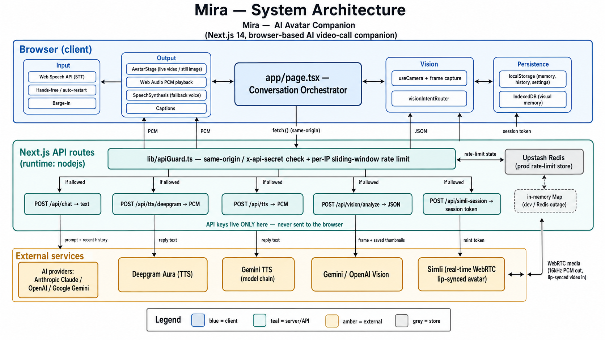
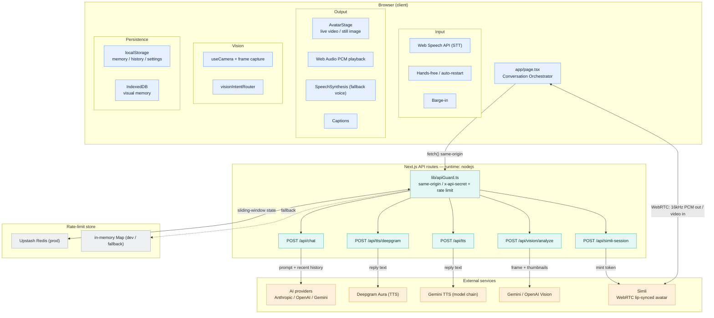
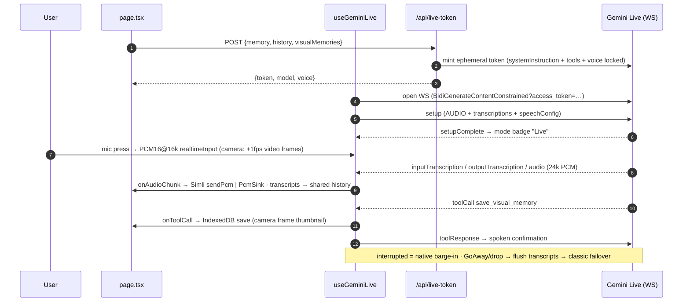
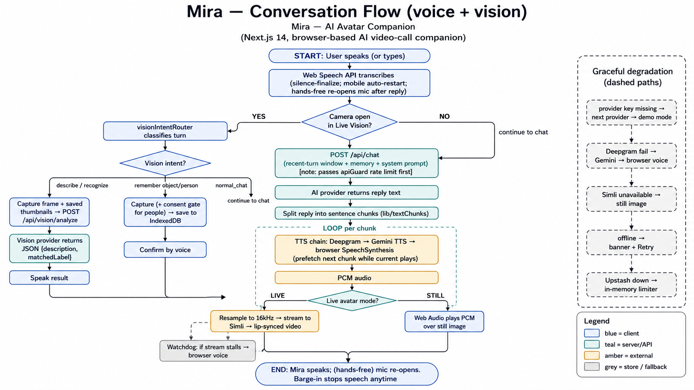
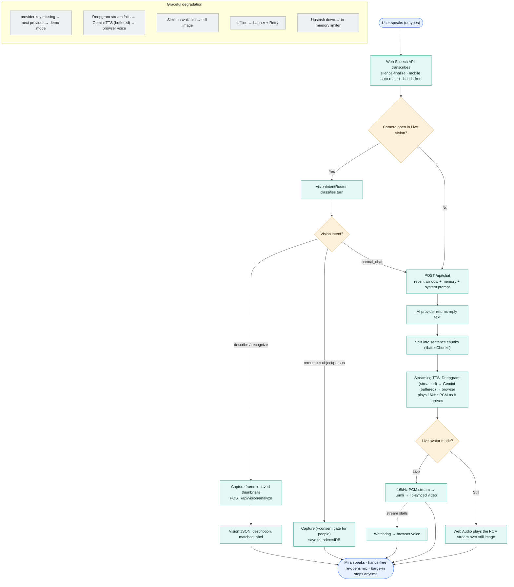
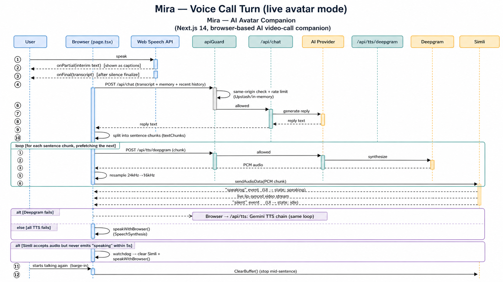
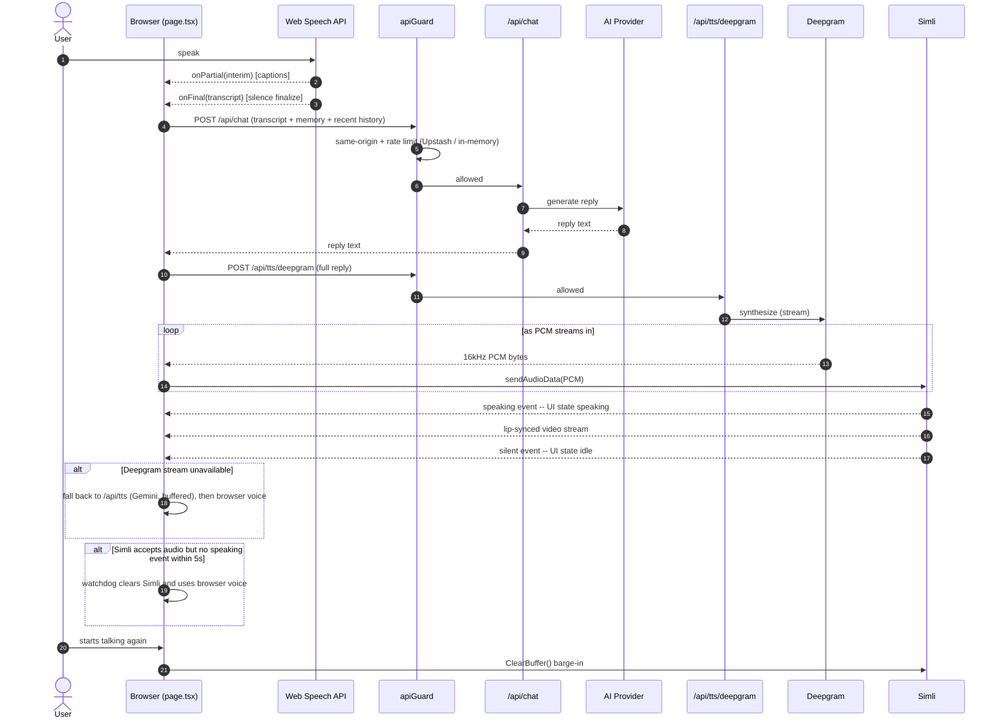
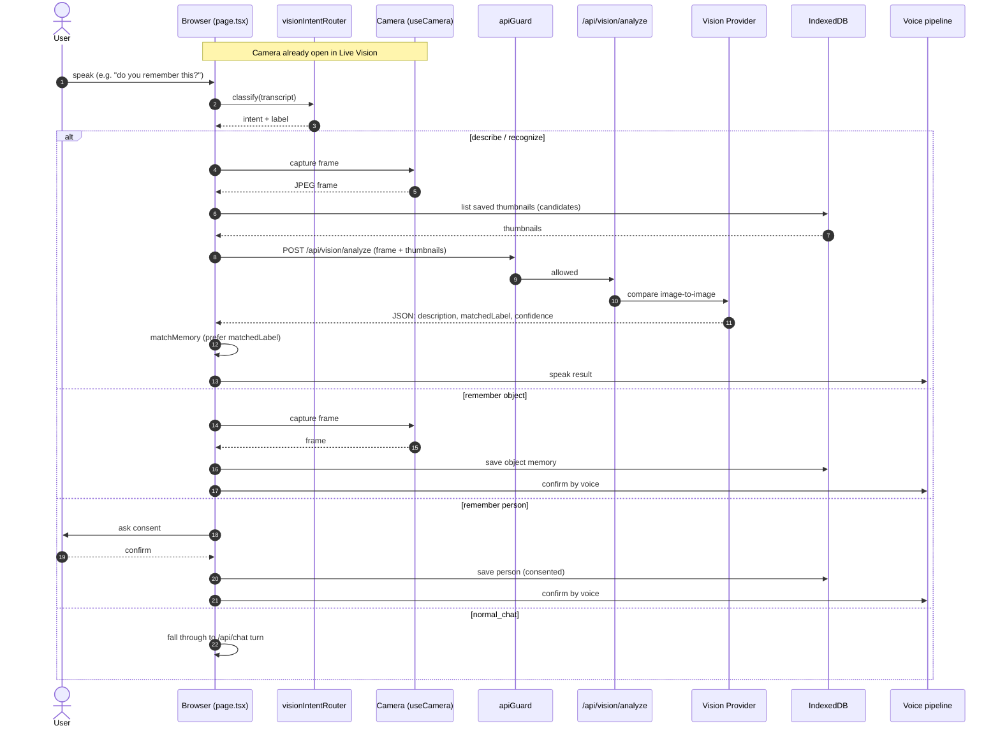

# Mira — Architecture & Diagrams

> For the cosmic UI re-skin (design system, AvatarOrb, theming, skeletons, chat
> attachments, and related fixes) see [UI_TRANSFORM.md](UI_TRANSFORM.md).

Visual reference for the **AI Avatar Companion**. Each section shows a rendered
image with the editable [Mermaid](https://mermaid.js.org/) source in a
collapsible block. The `.mmd` sources also live standalone in
[`docs/diagrams/`](diagrams/) — export them to SVG/PNG with the
[Mermaid CLI](https://github.com/mermaid-js/mermaid-cli):

```bash
npx -p @mermaid-js/mermaid-cli mmdc -i docs/diagrams/architecture.mmd -o docs/diagrams/architecture.png
```

> When the system changes, update the `.mmd` source, re-export the PNG, and keep
> the Mermaid block below in sync.

---

## 1. System architecture

A thin Next.js app: a rich browser client talks only to same-origin API routes,
which proxy the external providers. **API keys live only on the server.**



<details>
<summary>Mermaid source</summary>


```mermaid
flowchart TB
  subgraph CLIENT["Browser (client)"]
    direction TB
    ORCH["app/page.tsx<br/>Conversation Orchestrator"]
    subgraph IN["Input"]
      STT["Web Speech API (STT)"]
      HF["Hands-free / auto-restart"]
      BARGE["Barge-in"]
    end
    subgraph OUT["Output"]
      STAGE["AvatarStage<br/>live video / still image"]
      WEBAUDIO["Web Audio PCM playback"]
      SYNTH["SpeechSynthesis (fallback voice)"]
      CAP["Captions"]
    end
    subgraph VIS["Vision"]
      CAM["useCamera + frame capture"]
      ROUTER["visionIntentRouter"]
    end
    subgraph STORE_C["Persistence"]
      LS["localStorage<br/>memory / history / settings"]
      IDB["IndexedDB<br/>visual memory"]
    end
  end

  subgraph SERVER["Next.js API routes — runtime: nodejs"]
    GUARD["lib/apiGuard.ts<br/>same-origin / x-api-secret + rate limit"]
    CHAT["POST /api/chat"]
    TTSD["POST /api/tts/deepgram"]
    TTSG["POST /api/tts"]
    VISION["POST /api/vision/analyze"]
    SIMLISESS["POST /api/simli-session"]
  end

  subgraph EXT["External services"]
    AI["AI providers<br/>Anthropic / OpenAI / Gemini"]
    DG["Deepgram Aura (TTS)"]
    GTTS["Gemini TTS (model chain)"]
    VPROV["Gemini / OpenAI Vision"]
    SIMLI["Simli<br/>WebRTC lip-synced avatar"]
  end

  subgraph STORE_S["Rate-limit store"]
    REDIS["Upstash Redis (prod)"]
    MEM["in-memory Map (dev / fallback)"]
  end

  ORCH -->|"fetch() same-origin"| GUARD
  GUARD --> CHAT & TTSD & TTSG & VISION & SIMLISESS
  CHAT -->|"prompt + recent history"| AI
  TTSD -->|"reply text"| DG
  TTSG -->|"reply text"| GTTS
  VISION -->|"frame + thumbnails"| VPROV
  SIMLISESS -->|"mint token"| SIMLI
  ORCH <-->|"WebRTC: 16kHz PCM out / video in"| SIMLI
  GUARD <-->|"sliding-window state"| REDIS
  GUARD -.->|"fallback"| MEM

  classDef client fill:#e7f0ff,stroke:#5b8def,color:#13243a;
  classDef server fill:#e3f7f4,stroke:#3aa99a,color:#0f2e2a;
  classDef ext fill:#fdf0db,stroke:#d6a44c,color:#3a2c10;
  classDef store fill:#eef0f2,stroke:#9aa3ad,color:#23292f;

  class ORCH,STT,HF,BARGE,STAGE,WEBAUDIO,SYNTH,CAP,CAM,ROUTER,LS,IDB client;
  class GUARD,CHAT,TTSD,TTSG,VISION,SIMLISESS server;
  class AI,DG,GTTS,VPROV,SIMLI ext;
  class REDIS,MEM store;
```

</details>

---

## 2. Realtime voice — Gemini Live (primary pipeline)

> _New — no PNG exported yet; the Mermaid source below is the reference._

With `ENABLE_GEMINI_LIVE` + `GOOGLE_API_KEY` set, voice calls run over one
WebSocket instead of the classic STT → chat → TTS round trip. Everything below
falls back to the classic pipeline (section 3) on any failure, with
transcripts flushed into shared history first so no context is lost.

Key facts (all empirically verified — see `CLAUDE.md` for the gotchas):

- `/api/live-token` mints a **1-use ephemeral token**; the browser connects
  directly to Google (`BidiGenerateContentConstrained` + `access_token`). The
  API key never leaves the server.
- **All context lives in the token**: persona, user memory, recent history,
  and the visual-memory catalog are folded into the token's locked
  `systemInstruction`. A client-sent `systemInstruction` is silently ignored;
  `clientContent{turnComplete:false}` seeding hard-closes the socket.
- Voice is locked via `speechConfig` (`GEMINI_LIVE_VOICE` → `GEMINI_TTS_VOICE`
  → Aoede); without it Google uses its default male voice.
- **Live Vision**: camera frames stream at ~1 fps (`realtimeInput.video`);
  the model _sees_ natively. **Tool calling** (`save_visual_memory` /
  `forget_visual_memory`) persists to the same IndexedDB store — objects only,
  people stay consent-gated behind the Teach Person UI.
- Model audio (24 kHz PCM) plays through the SAME sinks as classic TTS:
  `sendPcm` → Simli (lip-sync) or the `ttsAudio` PcmSink (still mode), so
  barge-in/`stopServerTts()` cancels it identically.

<details>
<summary>Mermaid source</summary>


```mermaid
sequenceDiagram
  autonumber
  participant U as User
  participant P as page.tsx
  participant H as useGeminiLive
  participant T as /api/live-token
  participant G as Gemini Live (WS)

  P->>T: POST {memory, history, visualMemories}
  T->>G: mint ephemeral token (systemInstruction + tools + voice locked)
  T-->>P: {token, model, voice}
  H->>G: open WS (BidiGenerateContentConstrained?access_token=…)
  H->>G: setup (AUDIO + transcriptions + speechConfig)
  G-->>H: setupComplete → mode badge "Live"
  U->>H: mic press → PCM16@16k realtimeInput (camera: +1fps video frames)
  G-->>H: inputTranscription / outputTranscription / audio (24k PCM)
  H->>P: onAudioChunk → Simli sendPcm | PcmSink · transcripts → shared history
  G-->>H: toolCall save_visual_memory
  H->>P: onToolCall → IndexedDB save (camera frame thumbnail)
  H->>G: toolResponse → spoken confirmation
  Note over H,G: interrupted = native barge-in · GoAway/drop → flush transcripts → classic failover
```

</details>

---

## 3. Conversation flow — classic pipeline (voice + vision fallback)



> _Note: this PNG predates the streaming-TTS update — the Mermaid source below is current. Re-export to refresh._

<details>
<summary>Mermaid source</summary>


```mermaid
flowchart TB
  START(["User speaks (or types)"]) --> STT["Web Speech API transcribes<br/>silence-finalize · mobile auto-restart · hands-free"]
  STT --> DVIS{"Camera open in Live Vision?"}

  DVIS -- "Yes" --> CLS["visionIntentRouter classifies turn"]
  CLS --> DINT{"Vision intent?"}
  DINT -- "describe / recognize" --> VCAP["Capture frame + saved thumbnails<br/>POST /api/vision/analyze"]
  VCAP --> VJSON["Vision JSON: description, matchedLabel"]
  VJSON --> SPEAK
  DINT -- "remember object/person" --> VSAVE["Capture (+consent gate for people)<br/>save to IndexedDB"]
  VSAVE --> SPEAK
  DINT -- "normal_chat" --> CHAT

  DVIS -- "No" --> CHAT["POST /api/chat<br/>recent window + memory + system prompt"]
  CHAT --> REPLY["AI provider returns reply text"]
  REPLY --> CHUNK["Split into sentence chunks (lib/textChunks)"]
  CHUNK --> TTS["Streaming TTS: Deepgram (streamed) → Gemini (buffered) → browser<br/>plays 16kHz PCM as it arrives"]
  TTS --> DMODE{"Live avatar mode?"}
  DMODE -- "Live" --> LIVE["16kHz PCM stream → Simli → lip-synced video"]
  DMODE -- "Still" --> STILL["Web Audio plays the PCM stream over still image"]
  LIVE -.->|"stream stalls"| WD["Watchdog → browser voice"]
  LIVE --> SPEAK(["Mira speaks · hands-free re-opens mic · barge-in stops anytime"])
  STILL --> SPEAK
  WD --> SPEAK

  subgraph FALLBACK["Graceful degradation"]
    direction TB
    F1["provider key missing → next provider → demo mode"]
    F2["Deepgram stream fails → Gemini TTS (buffered) → browser voice"]
    F3["Simli unavailable → still image"]
    F4["offline → banner + Retry"]
    F5["Upstash down → in-memory limiter"]
  end

  classDef io fill:#e7f0ff,stroke:#5b8def,color:#13243a;
  classDef proc fill:#e3f7f4,stroke:#3aa99a,color:#0f2e2a;
  classDef dec fill:#fdf0db,stroke:#d6a44c,color:#3a2c10;
  classDef fb fill:#eef0f2,stroke:#9aa3ad,color:#23292f;

  class START,SPEAK io;
  class STT,CLS,VCAP,VJSON,VSAVE,CHAT,REPLY,CHUNK,TTS,LIVE,STILL,WD proc;
  class DVIS,DINT,DMODE dec;
  class F1,F2,F3,F4,F5 fb;
```

</details>

---

## 4. Sequence — classic voice call turn (live avatar mode)



> _Note: this PNG predates the streaming-TTS update — the Mermaid source below is current. Re-export to refresh._

<details>
<summary>Mermaid source</summary>


```mermaid
sequenceDiagram
  autonumber
  actor User
  participant B as Browser (page.tsx)
  participant SR as Web Speech API
  participant G as apiGuard
  participant C as /api/chat
  participant AI as AI Provider
  participant TD as /api/tts/deepgram
  participant DG as Deepgram
  participant S as Simli

  User->>SR: speak
  SR-->>B: onPartial(interim) [captions]
  SR-->>B: onFinal(transcript) [silence finalize]
  B->>G: POST /api/chat (transcript + memory + recent history)
  G->>G: same-origin + rate limit (Upstash / in-memory)
  G->>C: allowed
  C->>AI: generate reply
  AI-->>C: reply text
  C-->>B: reply text
  B->>G: POST /api/tts/deepgram (full reply)
  G->>TD: allowed
  TD->>DG: synthesize (stream)

  loop as PCM streams in
    DG-->>B: 16kHz PCM bytes
    B->>S: sendAudioData(PCM)
  end

  S-->>B: speaking event -- UI state speaking
  S-->>B: lip-synced video stream
  S-->>B: silent event -- UI state idle

  alt Deepgram stream unavailable
    B->>B: fall back to /api/tts (Gemini, buffered), then browser voice
  end

  alt Simli accepts audio but no speaking event within 5s
    B->>B: watchdog clears Simli and uses browser voice
  end

  User->>B: starts talking again
  B->>S: ClearBuffer() barge-in
```

</details>

---

## 5. Sequence — Mira Vision turn (remember / recognize)

> No exported image yet — render
> [`diagrams/sequence-vision-turn.mmd`](diagrams/sequence-vision-turn.mmd) with the
> Mermaid CLI to add one. The diagram renders inline below on GitHub.


```mermaid
sequenceDiagram
  autonumber
  actor User
  participant B as Browser (page.tsx)
  participant R as visionIntentRouter
  participant Cam as Camera (useCamera)
  participant G as apiGuard
  participant V as /api/vision/analyze
  participant VP as Vision Provider
  participant IDB as IndexedDB
  participant Voice as Voice pipeline

  Note over B,Cam: Camera already open in Live Vision
  User->>B: speak (e.g. "do you remember this?")
  B->>R: classify(transcript)
  R-->>B: intent + label

  alt describe / recognize
    B->>Cam: capture frame
    Cam-->>B: JPEG frame
    B->>IDB: list saved thumbnails (candidates)
    IDB-->>B: thumbnails
    B->>G: POST /api/vision/analyze (frame + thumbnails)
    G->>V: allowed
    V->>VP: compare image-to-image
    VP-->>B: JSON: description, matchedLabel, confidence
    B->>B: matchMemory (prefer matchedLabel)
    B->>Voice: speak result
  else remember object
    B->>Cam: capture frame
    Cam-->>B: frame
    B->>IDB: save object memory
    B->>Voice: confirm by voice
  else remember person
    B->>User: ask consent
    User-->>B: confirm
    B->>IDB: save person (consented)
    B->>Voice: confirm by voice
  else normal_chat
    B->>B: fall through to /api/chat turn
  end
```
